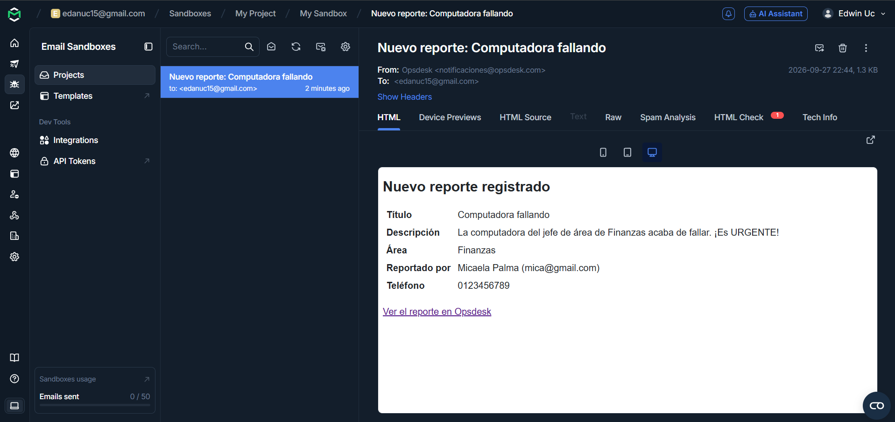

# 🚀 Opsdesk – Internal Reports Management System

## 📌 Overview
Opsdesk is a Laravel web application designed to manage internal reports and incidents across different departments within an organization.

It centralizes report creation, tracking, and administration, allowing employees to submit issues and administrators to review, update, and resolve them under a structured workflow.

The system emphasizes relational data integrity, role-based access control, and a clean server-rendered interface.

## 🏗 Architecture
The application follows Laravel's MVC structure:

- **Routes** → Define web endpoints and route protection
- **Controllers** → Handle business logic (reports, areas, authentication, profile, user management)
- **Models** → Eloquent ORM relational modeling
- **Policies** → Authorization rules for report ownership (`ReportPolicy`)
- **Form Requests** → Input validation isolated from controllers
- **Mailables** → Email notifications (`NewReportNotification`)
- **Blade Templates** → Server-rendered UI
- **Middleware** → Authenticated and role-based route protection

## 🔐 Authentication & Security
- Laravel built-in authentication (login/register)
- Password hashing via bcrypt
- The first user to register becomes admin automatically; every user after that starts as `employee` and can only be promoted by an existing admin from the user management panel
- Middleware-based route protection (`auth`, and a custom `admin` middleware for admin-only routes)
- Authorization for viewing, editing and deleting reports enforced through `ReportPolicy`, not inline checks in controllers: employees only see their own reports, and only admins change a report's status or delete it
- Reports are stored with a `restrict` foreign key on areas, so an area with reports cannot be deleted by accident

## 👥 Role-Based Access Control (RBAC)
**Admin**
- Create, edit, and delete reports
- Manage areas
- Manage user roles (promote/demote employees)
- Full visibility over all submitted reports

**Employee**
- Submit new reports
- View only their own reports and their status
- Edit their own reports, but cannot change the status (only admins do)
- No permission to delete reports or to manage areas

Roles are never derived from user-controlled data (such as an email domain). The first registered account becomes admin; every subsequent account must be promoted explicitly.

## 📧 Email Notifications
Every time a report is created, all users with the `admin` role receive an email with the report's title, description, area, reporter, phone number, and a direct link to the report.

The project is configured to use [Mailtrap Email Sandbox](https://mailtrap.io) for local development. The sandbox captures every email in a private inbox instead of delivering it to a real address, so the feature can be tested safely without a production mail server.



To run it yourself, create a free Mailtrap account, open a Sandbox inbox, and copy its SMTP credentials into your `.env` (see the table below).

## 📦 Core Modules
- User Management (registration, profile, role promotion by admins)
- Area Management
- Report Creation & Tracking
- Server-side search and pagination
- Email notifications on new reports

## 🛠 Tech Stack
`PHP 8.2+` · `Laravel 11` · `MySQL`

`Blade` · `Bootstrap 5` · `Vite`

`Mailtrap Sandbox` (email testing)

## ⚙️ Getting Started

### Installation
```bash
git clone https://github.com/EdannyDev/reports-app.git
cd reports-app
composer install
npm install
```

### Environment Variables
Copy `.env.example` to `.env` and fill in your own values:

```bash
cp .env.example .env
php artisan key:generate
```

| Variable | Description | Example |
|---|---|---|
| `APP_URL` | Base URL of the application | `http://localhost:8000` |
| `DB_CONNECTION` | Database driver | `mysql` |
| `DB_HOST` | Database host | `127.0.0.1` |
| `DB_PORT` | Database port | `3306` |
| `DB_DATABASE` | Database name | `reportsDB` |
| `DB_USERNAME` | Database username | `your_db_user` |
| `DB_PASSWORD` | Database password | `your_db_password` |
| `MAIL_MAILER` | Mail driver | `smtp` |
| `MAIL_HOST` | SMTP host (Mailtrap Sandbox) | `sandbox.smtp.mailtrap.io` |
| `MAIL_PORT` | SMTP port | `2525` |
| `MAIL_USERNAME` | Mailtrap inbox username | `your_mailtrap_username` |
| `MAIL_PASSWORD` | Mailtrap inbox password | `your_mailtrap_password` |
| `MAIL_FROM_ADDRESS` | Sender address | `notificaciones@opsdesk.com` |
| `MAIL_FROM_NAME` | Sender name | `Opsdesk` |

If you prefer not to create a Mailtrap account, set `MAIL_MAILER=log` and the emails will be written to `storage/logs/laravel.log` instead.

### Database Setup
```bash
php artisan migrate
php artisan db:seed --class=AreasTableSeeder
```

### Running the App
```bash
npm run build
php artisan serve
```

The app will be available at `http://127.0.0.1:8000`. Register the first account to become the system's initial admin.

---
Author: [@EdannyDev](https://github.com/EdannyDev)